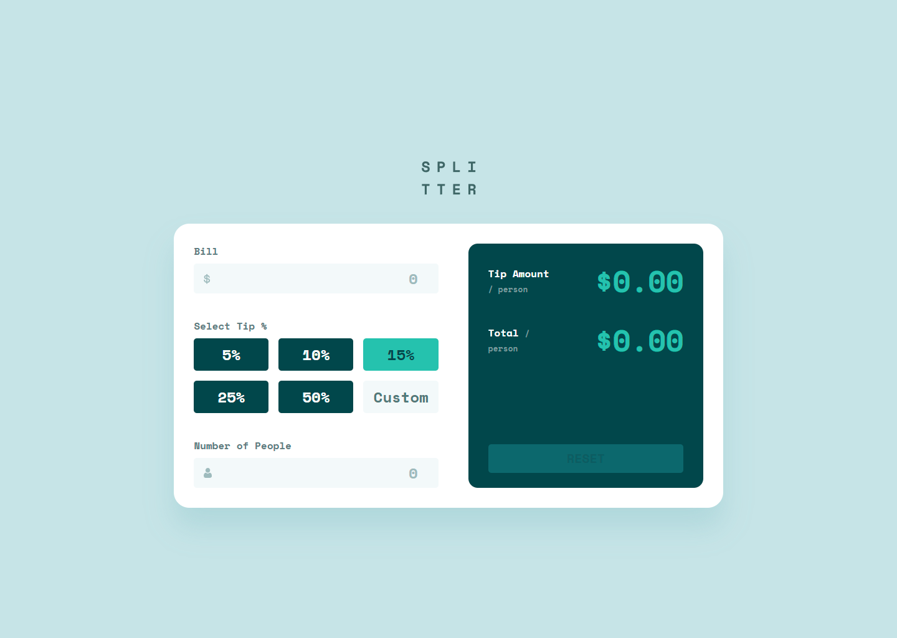

# Frontend Mentor - Tip calculator app solution

This is a solution to the [Tip calculator app challenge on Frontend Mentor](https://www.frontendmentor.io/challenges/tip-calculator-app-ugJNGbJUX). Frontend Mentor challenges help you improve your coding skills by building realistic projects.

## Table of contents

- [Overview](#overview)
  - [The challenge](#the-challenge)
  - [Screenshot](#screenshot)
  - [Links](#links)
- [My process](#my-process)
  - [Built with](#built-with)
  - [What I learned](#what-i-learned)
- [Author](#author)


## Overview

### The challenge

Users should be able to:

- View the optimal layout for the app depending on their device's screen size
- See hover states for all interactive elements on the page
- Calculate the correct tip and total cost of the bill per person

### Screenshot




### Links

- Solution URL: [github.com/RicardoGeada/fm-tip-calculator-app/](https://github.com/RicardoGeada/fm-tip-calculator-app/)
- Live Site URL: [ricardogeada.github.io/fm-tip-calculator-app/](https://ricardogeada.github.io/fm-tip-calculator-app/)

## My process

### Built with

- Semantic HTML5 markup
- SCSS
- Mobile-first workflow

### What I learned

In this project, I improved my understanding of semantic HTML and modern CSS selectors.

I learned how to properly use the <output> element for displaying calculated values instead of relying on regular input fields. This helped me write more semantic and accessible markup.

I also explored advanced CSS selectors like:

```CSS
label[for]:has(+ .input-with-icon input:not(:placeholder-shown):invalid)
```


This allowed me to handle validation states purely with CSS, without additional JavaScript. Working with selectors like :has(), :not(), and :invalid helped me better understand how powerful modern CSS can be.

Overall, I gained more confidence in form validation, cleaner structure, and writing maintainable code.

## Author

- Website - [ricardogeada.com](https://www.ricardogeada.com)
- Frontend Mentor - [@RicardoGeada](https://www.frontendmentor.io/profile/RicardoGeada)

